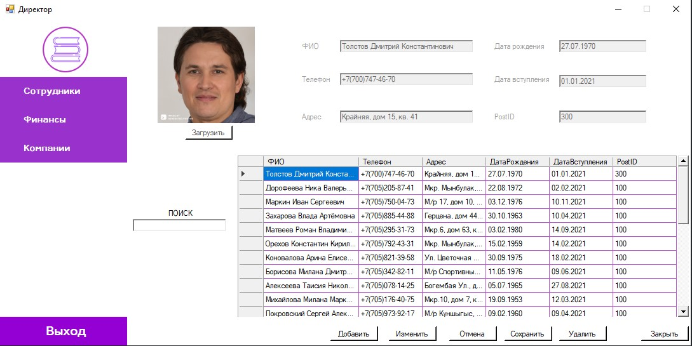
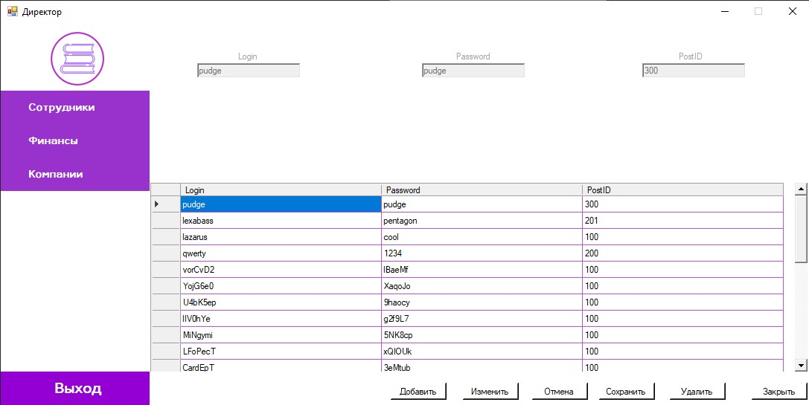
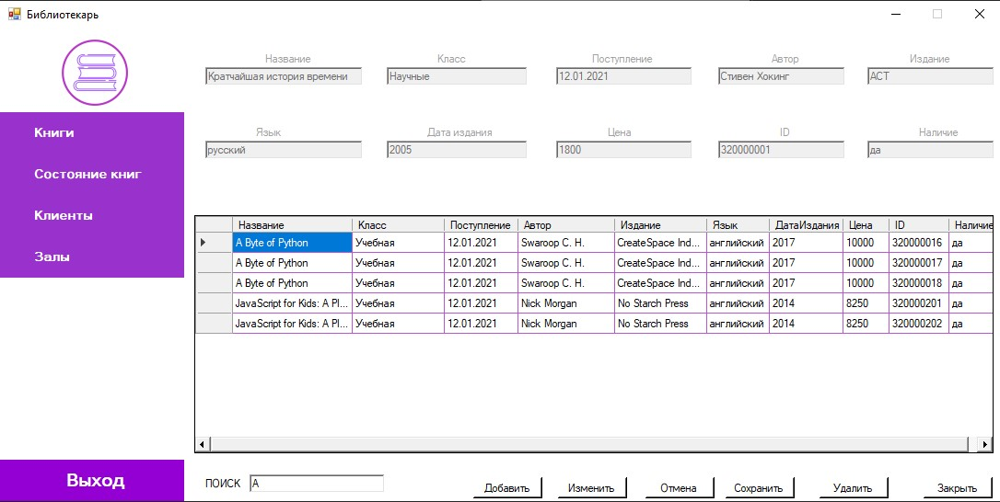
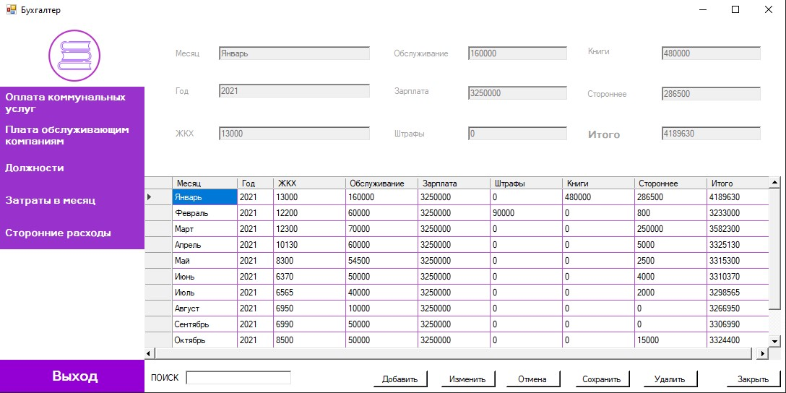

# Windows Forms Project Library_database

Course project on the topic "Library Database".

For development, the Visual Studio 2019 Community IDE was used.

The main task of the project is to work with the database. In this case, the **MS Access database** was involved.

The application has a system of accounts with access rights.
***
# RUN PROJECT EXE
# bin/Debug/Library.exe

***
**Some screenshots**
> Login page
> 
> 
>
> Director's page
> 
> 
> 
> Workers table
> 
> 
>
> Accounts table
> 
> 
>
> Librian's page
> 
> 
>
> Books table
> 
> 
>
> Bookkeeper
> 
> 
>
> System admin page
> 
> 
